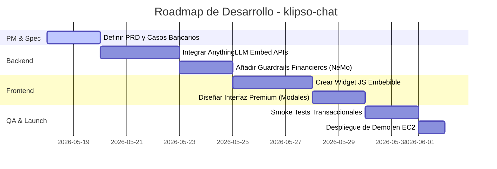

# Strategic Product Definition & Benchmark: klipso-chat 🚀

Este documento consolida la estrategia del producto **klipso-chat** y la estructura de repositorios y automatizaciones, enriquecida por la investigación real de mercado en tiempo real de **2026** (utilizando Firecrawl).

---

## 🗺️ 1. Arquitectura de Repositorios y Automatización

Para alinear el flujo agéntico y de negocio:

1. **`klipso_pm` (Estrategia y Gestión de Producto):**
   * **Propósito:** El "Cerebro del Negocio". Aquí viven este documento, los PRDs, los análisis de casos, y los recursos de Product Management.
   * **Rama activa:** `master` (en local) y `main` (remoto).
2. **`orquestacion_claude` (Orquestador Agéntico):**
   * **Propósito:** La "Fábrica del Código". Posee el orquestador agéntico (`crew_hive.py`), los administradores de entornos aislados (`worktree-manager.sh`), y la cola de tareas (`~/queue`).
3. **`klipso-chat` (Código Fuente del Producto):**
   * **Propósito:** El "SaaS Técnico". Contiene el widget JavaScript incrustable, el servidor backend RAG, y las integraciones con AnythingLLM.

---

## 📊 2. Matriz Competitiva 2026: Chatbase, Botpress, Flowise vs. Klipso

Basado en la investigación en tiempo real realizada con **Firecrawl**, el mercado de chatbots RAG en **2026** se divide en cuatro modelos de negocio. Aquí se ubican nuestros competidores directos y la oportunidad estratégica para **Klipso**:

| Competidor | Modelo de Cobro | Límites Free Tier | Add-ons Ocultos / Costosos | Debilidad Estratégica | Oportunidad para Klipso |
| :--- | :--- | :--- | :--- | :--- | :--- |
| **Chatbase** | Suscripción Flat Fija | 50 mensajes/mes, 1 bot, 400 KB de documentos. | Remoción de branding ($1,188/año), créditos extra ($40/1k). | Extremadamente costoso al escalar y para marcas profesionales. | **BYOK** (Trae tu API Key) para evadir costes por mensaje, branding gratis en planes básicos. |
| **Botpress** | Pay-as-you-go + AI Spend | 500 mensajes/mes, 1 bot, 1 asiento. | Cobra el spend de tokens del modelo del proveedor. | Complejo de presupuestar para no-técnicos; orientado a desarrolladores. | Ofrecer un modelo simplificado **Flat Predictivo** sin la fricción de configurar tokens. |
| **Flowise** | Open Source (Self-Hosted) | Gratis (licencia MIT). | Hosting, bases vectoriales y costos de LLM se pagan por separado. | Requiere conocimientos técnicos elevados (Docker, servidores, código). | **Plug-and-play** absoluto: una sola línea de JS sin configurar servidores. |
| **Crisp** | Tarifa Plana por Workspace | 0 bots en free tier (solo live chat básico). | Funciones de IA amarradas a planes Plus ($295/mes). | Caro si solo buscas un bot de IA de auto-respuesta. | RAG enfocado a menor costo para startups y Pymes. |

---

## 🎯 3. Propuesta Estratégica: Las 7 Definiciones de Scope

### Q1. Industria para Demo V1 — ¿Banca, Ecommerce, Clínica?
* **Propuesta:** **Banca y Fintech.**
* **Justificación:** Ya contamos con el dataset real de **NeMo-Guardrails** en el EC2 (`~/ai-product/NeMo-Guardrails/nemoguardrails/evaluate/data/topical/banking/`) con más de 80 intents transaccionales y de soporte financiero. Esto nos permite simular un entorno premium, seguro (anti-reverse engineering) y de alta fidelidad para la demo inicial.

### Q2. Límites del Plan Gratuito (Free Tier)
* **Propuesta:**
  * **Mensajes:** 100 mensajes al mes.
  * **Documentación:** Hasta 2 archivos (límite acumulado de 1 MB).
  * **Widgets:** 1 widget embebible activo.
  * **Contexto:** Soporte para BYOK (el usuario puede configurar su propia API Key de OpenAI/Gemini para no tener límites de mensajes en la infraestructura de Klipso).

### Q3. Escalación y Fallback (Cuando el bot no sabe)
* **Propuesta:** **Formulario de Soporte Híbrido + Botón Rápido de WhatsApp.**
  * Si el bot no puede responder o se activan guardrails:
    1. Muestra un formulario de contacto directo dentro del widget (nombre, correo, mensaje) que se envía por webhook/email al administrador de la web.
    2. Habilita opcionalmente un botón flotante: *"Hablar con un Humano por WhatsApp"*.

### Q4. Branding en Free Tier
* **Propuesta:** **Sello "Powered by Klipso" visible.**
  * El widget incluirá el sello en la parte inferior de la ventana de chat.
  * La opción para remover el branding estará disponible a partir del plan **Growth ($29/mes)**.

### Q5. Posicionamiento frente a Competidores
* **Posicionamiento:** *"El widget de chat RAG con control total de costes y privacidad".*
  * Destacaremos: **BYOK** (ahorro masivo de intermediación de tokens), seguridad ante inyecciones de prompts y soporte nativo multidispositivo sin código.

### Q6. Estrategia de Despliegue (Deployment)
* **Propuesta:** **Despliegue Híbrido en el mismo EC2 (Fase Alpha) → Separación en Producción.**
  * Para desarrollo y testeo, levantaremos AnythingLLM y el frontend en puertos específicos del EC2 actual (`107.21.24.49`), aislando el backend en Docker.
  * Para la fase comercial (Beta), migraremos el frontend a Vercel/Render y la base vectorial RAG a un servicio administrado.

### Q7. Repositorio Organizacional
* **Propuesta:** Iniciar en `StephCastrof001/klipso-chat` para acelerar los ciclos de codificación integrados con nuestro orquestador agéntico en el EC2, y migrarlo a una organización oficial `Klipso` al formalizar el lanzamiento comercial.

---

## 🚀 4. Roadmap de Desarrollo V1 (Fase Alpha)

